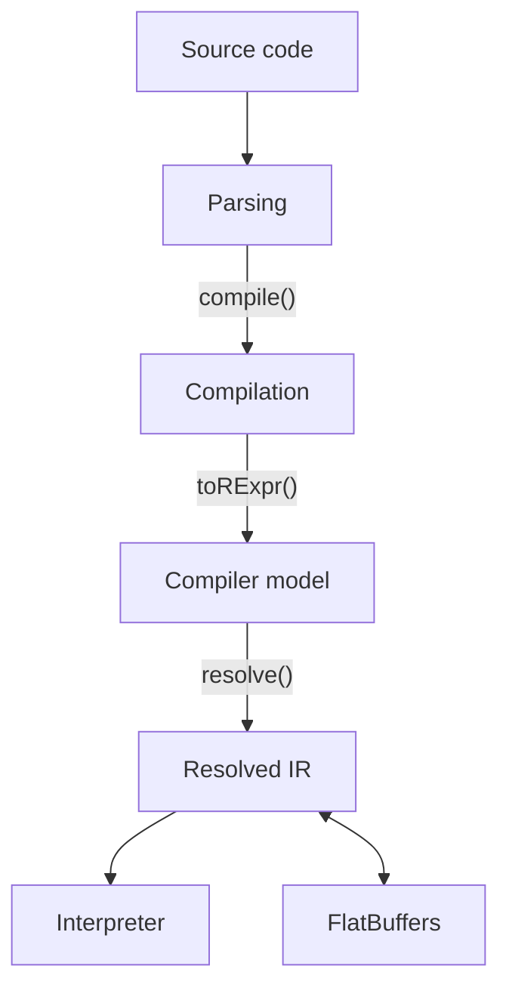
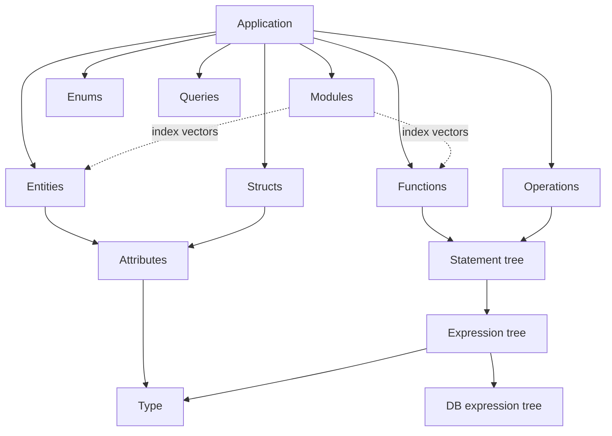
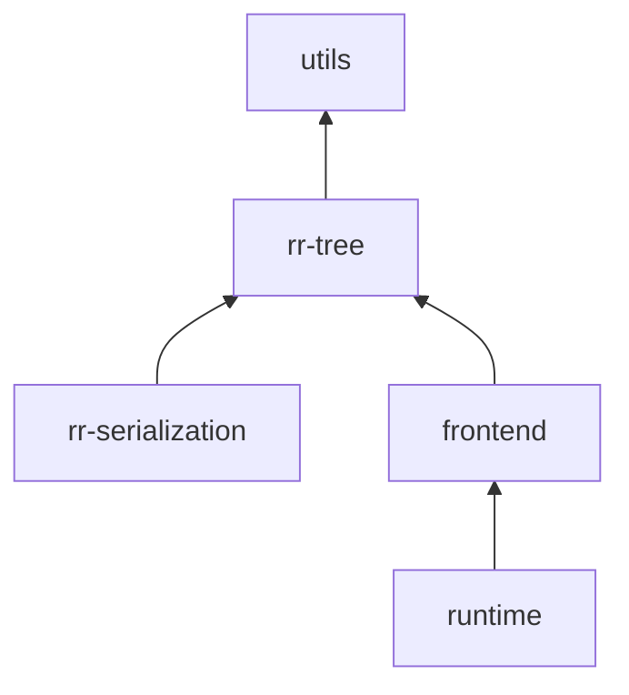

# Rell Architecture

## Compilation pipeline

Rell source code goes through five transformations before execution.

**Parsing** produces an abstract syntax tree — one file node per source file,
containing definitions, statements, and expressions. Classes use the `S_`
prefix.

**Compilation** drives type-checking and name resolution through 13 ordered
passes (`DEFINITIONS` through `FINISH`). Compiler contexts track scope,
expected types, and error state. An intermediate value-expression layer bridges
compiled expressions to the model. Classes use the `C_` and `V_` prefixes.

**Compiler model** is the output of compilation — the full application as a
graph of definitions, types, expressions, and statements. Mutable, with lazy
fields, compiler-internal sentinels, and singleton type objects that are
convenient for multi-pass compilation. Classes use the `R_` prefix.

**Resolved IR** is produced by a single `resolve()` call after all compiler
passes complete. Resolution forces every lazy field, drops compiler and IDE
baggage, and replaces live object references with integer indices into flat
arrays. The result is an immutable, self-contained data structure that can be
serialized to FlatBuffers and deserialized without the compiler. This is the
**only** model the runtime consumes. Classes use the `RR_` prefix.

**Interpreter** dispatches on the sealed IR expression, statement, and
database-expression trees via exhaustive pattern matching. It produces runtime
values and generates SQL directly from database expression nodes. Classes use
the `Rt_` prefix.

### Other layers

The **library framework** (`L_`) declares the standard library's types and
functions via a Kotlin DSL. The **type system** (`M_`) represents the full type
lattice — simple types, nullability, composites, functions, tuples, and
parametric type variables with variance and bounds. **Grammar helpers** (`G_`)
are internal utilities for the better-parse parser combinators (wrapping parsed
values with source positions). **Database expressions** (`Db_`) are data-only
compilation artifacts representing at-expressions; they are converted to
`RR_DbExpr` during resolution and are not used at runtime.

## Resolved IR tree

`resolve()` walks the compiler model, forces all lazy fields, and produces a
self-contained application IR. Every definition cross-reference becomes an
integer index into a flat array; every type becomes a plain data class.

**Flat arrays + index references.** The application stores all definitions of
each kind in flat arrays. A type like `Entity(defIndex=3)` is just an integer
offset into the entities array.

The wire format follows this same shape: serialized modules carry only index
vectors pointing into the app-level definition arrays, so the on-disk
representation has zero redundancy. The in-memory `RR_Module`, by contrast,
holds direct `ImmMap<String, RR_*Definition>` references for ergonomic access
during interpretation. Deserialization reconstitutes those maps from the
index vectors. The redundancy is intentional and confined to memory; readers
should treat the index vectors as the canonical wire form and the maps as a
materialized convenience view.

**Types** form a sealed data hierarchy with ~20 variants: primitives, null,
definition-backed types (entity, struct, enum, object — each carrying a
definition index), composites (nullable, list, set, map, tuple, function),
virtual types, and a few special cases.

**Expressions, statements, and DB expressions** are sealed data trees. They
are pure data with no behavior — all execution logic lives in the interpreter.
There are ~35 expression variants, ~17 statement variants, and ~16 DB
expression variants.

### Key invariant

> `interpret(compile(code)) ≡ interpret(deserialize(serialize(compile(code))))`

Anything the interpreter needs must live on the IR tree itself. If a
FlatBuffers round-trip changes behavior, it's a bug.

## Module structure

`rell-base` is split into sub-modules with enforced dependency boundaries:

**rr-tree** defines the IR data classes. It depends only on shared utilities —
zero imports from the compiler or the interpreter. A consumer that only needs
to deserialize an application pulls in `rr-tree` + `rr-serialization` without
the compiler or the interpreter.

**rr-serialization** reads and writes the IR to FlatBuffers binary format. The
`flatc` compiler is auto-provisioned at build time.

**frontend** contains the compiler: parsing, AST, compilation passes, the
compiler model, type system, library framework, and the `resolve()` function
that produces the IR.

**runtime** contains the interpreter, runtime values, SQL generation, and
standard library implementations. It depends on the frontend (for now), but
operates exclusively on the resolved IR — never on compiler-internal types.

The frontend/runtime split enforces a hard boundary: the compiler cannot import
runtime values, and the interpreter cannot import compiler-internal lazy
fields.

## Runtime type resolution

The interpreter resolves IR types to runtime type descriptors on demand
(cached). Each runtime type bundles the capabilities needed at execution time:

- **SQL adapter** — bind values to prepared statements, read from result sets
- **GTV conversion** — serialize/deserialize to the GTV wire format
- **Comparator** — sort and compare values of this type
- **Default value** — the zero value for uninitialized variables

For definition-backed types (entity, struct, enum), purpose-built
implementations walk the IR tree directly to derive these capabilities — no
compiler model reconstruction required.

## Standard library dispatch

The standard library is represented as three maps: system functions, DB binary
operators, and DB unary operators. The IR tree references stdlib functions by
string name; the interpreter looks them up in these maps.

The maps are populated during classloading by the stdlib DSL via a
process-wide registry (`Rt_StdlibEnv`), then snapshotted to immutable maps
before any interpretation runs. Writes are confined to startup; by the time
`Rt_StdlibEnv.global()` is consumed, the contents are fixed for the lifetime
of the process.

## FlatBuffers serialization

The `rr-serialization` module serializes the resolved IR to a compact binary
format. The FlatBuffers schema mirrors the IR tree structure:

| Schema      | Content                                                                      |
|-------------|------------------------------------------------------------------------------|
| `app.fbs`   | Root table, flat definition arrays, modules with index vectors               |
| `def.fbs`   | Entity, struct, enum, object, operation, query, function definitions         |
| `ir.fbs`    | Expression (36 variants), statement (17), DB expression (16), function calls |
| `type.fbs`  | Type union (~20 variants: primitives, definition-index-backed, composites)   |
| `frame.fbs` | Call frames, frame blocks, variable pointers                                 |

## Database layer

Rell's at-expressions (`entity @* { .name == 'x' }`) compile to DB expression
trees in the resolved IR. The interpreter generates parameterized SQL directly
from these trees — handling alias allocation, JOIN tracking, and WHERE clause
construction. Create, update, and delete operations flow through dedicated
interpreter modules. All SQL uses jOOQ parameterized queries; table names
derive from structured mount-name values, not raw strings.
