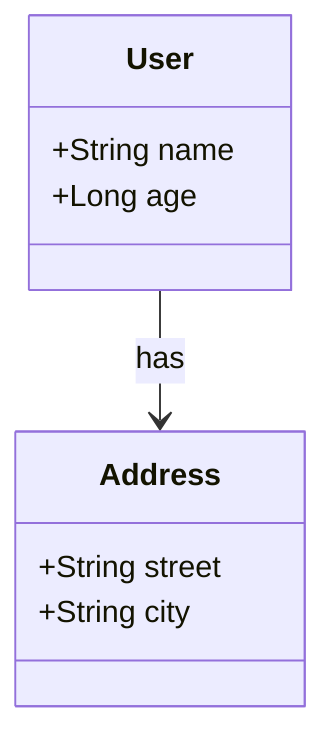

# CLI Usage Guide

Complete reference for the `rellgen` command-line tool.

## Basic Syntax

```bash
rellgen [OPTIONS] <source> <target>
```

## Required Arguments

### `<source>`
Path to the directory containing Rell source files (.rell files).

**Examples:**
```bash
./src              # Relative path
/home/user/project/rell  # Absolute path
```

**Requirements:**
- Must be a valid directory
- Should contain at least one `.rell` file
- Subdirectories are scanned recursively

### `<target>`
Path to the output directory where generated code will be written.

**Examples:**
```bash
./generated
/home/user/project/client
```

**Behavior:**
- Directory is created if it doesn't exist
- Existing files may be overwritten
- Subdirectories created based on language conventions

## Language Options

At least one language flag must be specified.

### Kotlin: `--kotlin --package <package_name>`

**Required Parameter:**
- `--package <text>`: Kotlin package name for generated code

**Example:**
```bash
rellgen ./rell-src ./target --kotlin --package com.example.myapp
```

**Output Structure:**
```
target/
└── com/
    └── example/
        └── myapp/
            └── Main.kt
```

**Generated Code Style:**
- Data classes for entities and structs
- Enum classes for enums
- Extension methods on `PostchainQuery` for queries
- Extension methods on `TransactionBuilder` for operations

**Dependencies Required:**
```kotlin
implementation("net.postchain:postchain-client:<latest>")
implementation("net.postchain:postchain-gtv:<latest>")
```

### TypeScript: `--typescript`

Generate TypeScript client code.

**Example:**
```bash
rellgen ./rell-src ./target --typescript
```

**Output Structure:**
```
target/
└── main.ts
```

**Generated Code Style:**
- Interfaces for entities and structs
- Enum types for enums
- Async functions for queries and operations
- Uses `IClient` interface from postchain-client

**Dependencies Required:**
```bash
npm install postchain-client
```

### JavaScript: `--javascript`

Generate JavaScript client code (no TypeScript types).

**Example:**
```bash
rellgen ./rell-src ./target --javascript
```

**Output Structure:**
```
target/
└── main.js
```

**Generated Code Style:**
- Plain JavaScript objects
- Numeric enums (constants)
- Async functions for queries and operations

**Dependencies Required:**
```bash
npm install postchain-client
```

**Note:** Variable name in CLI source has typo (`JavscriptOption`), but functionality is correct.

### Python: `--python`

Generate Python client code.

**Example:**
```bash
rellgen ./rell-src ./target --python
```

**Output Structure:**
```
target/
└── main.py
```

**Generated Code Style:**
- Dataclasses for entities and structs
- Enum classes for enums
- Functions for queries and operations
- Type hints throughout

**Dependencies Required:**
```bash
pip install postchain-client
```

### Mermaid: `--mermaid [--entity-relation] [--mdx]`

Generate Mermaid diagram documentation.

**Subflags:**
- `--entity-relation`: Generate entity-relationship diagram (default: class diagram)
- `--mdx`: Wrap diagram in MDX tags for documentation frameworks

**Examples:**
```bash
# Class diagram (default)
rellgen ./rell-src ./target --mermaid

# Entity-relationship diagram
rellgen ./rell-src ./target --mermaid --entity-relation

# MDX-compatible output
rellgen ./rell-src ./target --mermaid --mdx
```

**Output Structure:**
```
target/
└── main.mmd
```

**Generated Content:**
````markdown
# main


````

## Module Filtering: `--module <modules>`

Generate code only for specific Rell modules.

**Syntax:**
```bash
--module module1,module2,module3
```

**Example:**
```bash
--module auth,user,payment
```

**Behavior:**
- Only specified modules are processed
- Module names are comma-separated (no spaces)
- Module names are case-sensitive
- Must match module names declared in Rell source

**Use Case:**
Large Rell projects with many modules where you only need client code for specific modules.

## Complete Examples

### Single Language

```bash
# Generate Kotlin only
rellgen \
  ./rell-src \
  ./generated/kotlin \
  --kotlin --package com.mycompany.blockchain
```


## Help 

### Display Help

```bash
rellgen --help
```

