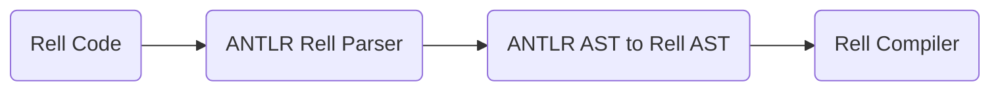

# Rell Toolbox Core

This is the core module of the Rell Toolbox project.
It contains:
- [Rell ANTLR4 Parser](#rell-antlr4-parser)
- [Rell ANTLR AST to Rell Compiler AST Converter](#rell-antlr-ast-to-rell-ast-converter)
- [Rell Compiler API and Resources](#rell-compiler-api-and-resources)
- [Rell Workspace Indexer](#rell-workspace-indexer)
- [Rell Semantic Tokens Provider](#rell-semantic-tokens-provider)

Reference documentation can be found [here](https://rell-lang-enhancers-chromaway-core-tools-f03d821ef44cc39334862e.gitlab.io/core/html/).

## Rell ANTLR4 Parser
- Rell parser is generated using [ANTLR4](https://github.com/antlr/antlr4).
- The grammar file is located in [Rell.g4](../src/main/antlr/net.postchain.rell.toolbox.core.parser/Rell.g4).
- The parser is recoverable, which means that it can parse the code even if there are some errors in it.
  This is very useful for IDEs/Language server, because they can provide all their features even if the code is not valid.
- Used by [Rell Language Server](../language-server) and [Rell Formatter](../../formatter).
- Can be used by other projects that need to parse Rell code.

### Rell ANTLR4 Parser Usage
```kotlin
val parser = AntlrRellParser()
val antlrAST = parser.parse("module; function foo() { return 1; }")
```

Other useful classes include:
- `RellLexer` - ANTLR4 generated lexer
- `RellParser` - ANTLR4 generated parser
- `RellListener` - Defines a complete listener for a parse tree produced by
`RellParser`.
- `RellBaseListener` - Provides an empty implementation of `RellListener` interface,
which can be extended to create a listener which only needs to handle a subset
of the available methods.
- `RellVisitor` - Defines a complete generic visitor for a parse tree produced
by `RellParser `
- `RellBaseVisitor` - Provides an empty implementation of `RellVisitor` interface, 
which can be extended to create a visitor which only needs to handle a subset of the available methods.

### ANTLR parser classes generation
- Rell ANTLR parser classes are generated from  [Rell.g4](../src/main/antlr/net.postchain.rell.toolbox.core.parser/Rell.g4) grammar using `generateGrammarSource` gradle task.
- Generated classes are located in `src/main/gen` directory.
- Generated classes are committed to the repository
- `generateGrammarSource` task is also executed before each build, so there is no need to run it manually.


## Rell ANTLR AST to Rell AST Converter
Rell compiler uses non-recoverable parser, so it can't be used for IDEs/Language server.
In order to make Rell compiler validate partially broken Rell code, we use ANTLR parser for recovery and then 
convert ANTLR AST to Rell AST.
`RellcAPI.antlrToRellAst()` method is responsible for this.
Then Rell compiler uses Rell AST to validate the code.

Whole process looks like this:


Related useful classes:
- `AntlrToRell` - Defines list of transformers for each Rell ANTLR AST node type.
- `RellcUtils` - Utilities for node conversion


## Rell Compiler API and Resources
- `Resource` data class encapsulates all important data about single compiled Rell file (ASTs, errors, symbol info, etc.)
- `RellResourceFactory` class is responsible for creating `Resource(s)` from Rell files.

## Rell Workspace Indexer
To reason about Rell project, we need to have an index of all the rell code in workspace/folder(s).
This index is used by Rell LSP server to provide code semantic tokens, go to definition, find references, etc.
`WorkspaceIndexer` is responsible for creating/updating the index and reporting all errors inside the workspace.


## Rell Semantic Tokens Provider
Rell language server provides [semantic tokens](https://microsoft.github.io/language-server-protocol/specifications/lsp/3.17/specification/#textDocument_semanticTokens) 
for Rell code. which are used by IDEs to highlight the code.
`RellSemanticTokensProvider` class is responsible for this.

