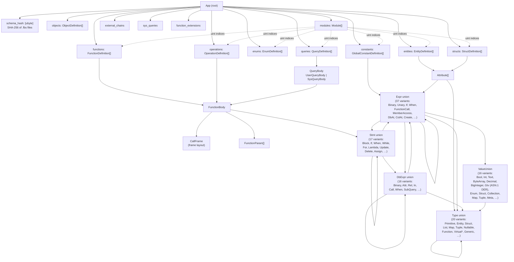

# rr-serialization

FlatBuffers serialization of `RR_App`, the resolved, immutable intermediate
representation produced by the Rell compiler. Lets a compiled Rell application
cross process/disk boundaries as a self-contained binary buffer, with a
round-trip guarantee:

```
interpret(compile(code)) ≡ interpret(deserialize(serialize(compile(code))))
```

The invariant is exercised in CI via `testRoundTrip` on every `./gradlew check`.

## What's in the buffer

`App` is the root table. Definitions are stored in flat arrays indexed by
`uint`; modules hold index vectors back into those arrays. Bodies nest through
recursive `Stmt`/`Expr`/`DbExpr` unions with typed discriminators.



Every union has an explicit `ubyte` discriminator; no Kotlin-ordinal encoding
on the wire. Optional scalars use FB 2.0 `= null` instead of the `has_X + X`
pattern. GTV constants are stored as canonical ASN.1 DER bytes, not JSON. The
`schema_hash` field is a SHA-256 of all `.fbs` files, computed at build time and verified on deserialize.

## Security

### Can a crafted RR_App binary do more than Rell code?

Since `RR_App` can be serialized and sent across process boundaries, a natural
question is: can someone craft a malicious FlatBuffers binary that makes the
interpreter do something that valid Rell source code cannot?

**Short answer: no, it cannot escalate beyond what Rell already allows.** The
RR tree is a data structure, not executable code. The interpreter controls
what operations are possible:

- System functions are looked up by name from a fixed registry
  (`Rt_StdlibEnv`). A crafted binary can put any string in `fnName`, but if it
  doesn't match a registered stdlib function, the interpreter throws an error.
  You can't call arbitrary JVM methods &mdash; only the functions the stdlib
  explicitly registered.
- SQL table/column names come from `MountName` (structured, validated
  identifier) and `RR_EntitySqlMapping`. These go through
  `Rt_ChainSqlMapping.fullName()` which prepends a chain-specific prefix. You
  can't inject raw SQL &mdash; the interpreter uses parameterized queries via jOOQ,
  and table names are derived from mount names, not passed as raw strings.
- Definition indices (`entityDefIndex`, `structDefIndex`, etc.) are just
  integers into flat arrays. An out-of-range index is rejected during
  deserialization (see hardening below) &mdash; a crash, not a privilege
  escalation.
- No new capabilities. The RR tree can express `if`, `when`, function
  calls, DB queries, create/update/delete &mdash; the same operations Rell source
  code compiles to. There are no "hidden opcodes" that the compiler never
  emits but the interpreter would accept.

What a crafted binary **can** do (same as buggy Rell code): crash the
interpreter with invalid indices, cause infinite loops via cyclic expression
trees, or waste memory with deeply nested structures. These are
denial-of-service at the app level, not a security concern &mdash; and they affect
only the app that shipped the bad binary.

In the Postchain deployment model, the entity deploying a Rell module is the
one whose app runs it. Crafting invalid IR breaks your own app, not others' &mdash;
each app's SQL tables are prefixed by chain, and the interpreter runs within
the app's execution context.

### Current usage

`deserializeRellApp` is not currently used from any production code path in
`rell-gtx` or `rell-api-gtx`. The production compiles from source each time.

### Precautions made

Despite the low exposure today, the deserializer was audited against an
attacker who controls the bytes. The findings and fixes live in
`DeserializerGuards.kt` and the call sites it protects.

| Attack primitive                                                      | Mitigation                                                                                                                                                                                                                            |
|-----------------------------------------------------------------------|---------------------------------------------------------------------------------------------------------------------------------------------------------------------------------------------------------------------------------------|
| Unbounded `ByteArray(length)` allocation from wire length             | `checkedByteArrayLength` caps at `MAX_BYTE_ARRAY_SIZE = 100 MB`; GTV sites at `MAX_GTV_SIZE = 10 MB`                                                                                                                                  |
| Unbounded vector allocation on wire-specified length                  | `checkedVectorLength` caps at `MAX_VECTOR_SIZE = 10 M` elements; top-level buffer capped at `MAX_BUFFER_SIZE = 500 MB` before `getRootAsApp`                                                                                          |
| Garbage offset → wild dereference (flatbuffers-java lacks `Verifier`) | `safeDeserialize { … }` wraps the entry point so that malformed-buffer failures from the generated accessors surface as a single typed deserialization error instead of leaking a grab-bag of accessor-internal errors to the caller. |
| `GtvFactory.decodeGtv` unbounded recursion on nested ASN.1            | Size gate at `MAX_GTV_SIZE`; ASN.1 decoder and JSON encoder paths are wrapped so malformed GTV surfaces as a typed deserialization error.                                                                                             |
| `UInt.toInt()` wrap-around → negative index                           | `checkedUIntAsIndex` at the load-bearing sites (`resolveIndexed`, `deserializeObjectDefinition`); remaining `.toInt()` sites contained by `safeDeserialize`.                                                                          |
| Duplicate mount names silently overwrite (consensus-divergence lever) | `associateByFailOnDup` replaces `associateBy` for operations/queries map construction.                                                                                                                                                |
| Schema drift between producer and consumer                            | `App.schema_hash` = SHA-256 of schema files, verified on deserialize.                                                                                                                                                                 |
| Deep recursion                                                        | `withDeserializerDepth` (`ThreadLocal` counter, cap `MAX_RECURSION_DEPTH`) guards recursive functions.                                                                                                                                |

### Basic fuzzing

`DeserializerFuzzTest.kt` runs on every build with 2,000 deterministic random
inputs plus byte-flip and truncation sweeps over a real valid buffer. The
invariant under test: `deserializeRellApp` either succeeds or fails with a
typed deserialization error &mdash; no uncategorized escape, no VM-fatal crash.

## Build integration

The module ships its own flatc binary provisioning and Kotlin codegen.

- `build/generated/flatbuffers/kotlin/` &mdash; `--kotlin --gen-all` output of flatc
  over `src/main/flatbuffers/*.fbs`.
- `build/generated/schemaHash/kotlin/` &mdash; `FbsSchemaHash.kt` with the SHA-256
  constant, regenerated whenever any `.fbs` file changes.

Both are wired into `tasks.compileKotlin.dependsOn(...)`. A flatc gen bug
(union accessors typed as non-nullable `Table` when the body can return `null`)
is patched in-flight by a text replace in `generateFlatBuffersKotlin`.
