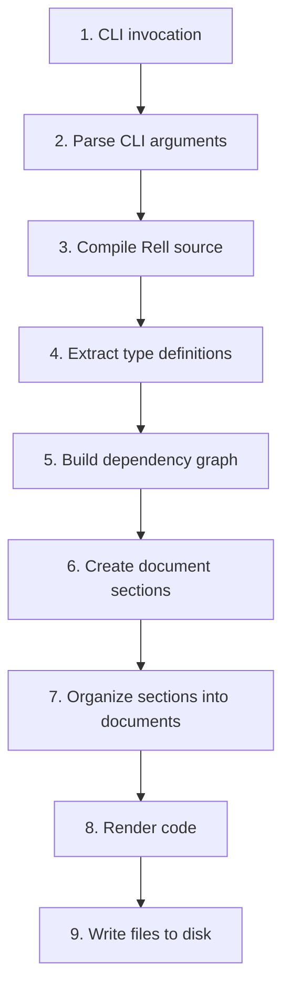
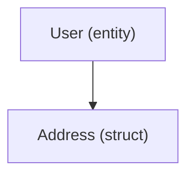

# Code Generation Process (Internals)

Deep dive into how rell-codegen works internally, from Rell source to generated client code.

## Overview

This document explains the internal workings of rell-codegen for developers who want to:
- Understand the codebase architecture
- Debug generation issues
- Contribute new features
- Add new target languages

## High-Level Flow



## Step 1: CLI Invocation

**Entry Point:** `rellgen/src/main/kotlin/App.kt`

```kotlin
fun main(args: Array<String>) {
    CodeGenCommand().main(args)
}
```

**CodeGenCommand** (extends Clikt's `CliktCommand`):
- Parses command-line arguments
- Validates source/target paths
- Collects language option groups

**Language Option Groups:**
- `KotlinOptionGroup` - Kotlin-specific flags (`--package`)
- `TypescriptOption` - TypeScript flag
- `JavscriptOption` - JavaScript flag (the name is misspelled in the source)
- `PythonOption` - Python flag
- `MermaidOption` - Mermaid diagram flags

## Step 2: Rell Compilation

**Location:** `codegen/src/main/kotlin/CodeGenerator.kt`

The core orchestrator compiles Rell source using Rell's compiler API:

```kotlin
val compileResult = RellApiCompile.compileApp(
    sourceDir = sourceDirectory,
    options = CompilerOptions(
        // Compiler configuration
    )
)
```

**Rell Compiler API:**
- Parses `.rell` files into Abstract Syntax Tree (AST)
- Performs semantic analysis (type checking, name resolution)
- Produces compiled application with full type information

**Output:** `RellCompiledApp` containing:
- All modules
- All type definitions (entities, structs, enums)
- All functions (queries, operations)
- All dependencies and imports

**Error Handling:**
If Rell compilation fails, errors are reported to the user and generation stops.

## Step 3: Type Extraction

The `CodeGenerator` traverses the compiled app to extract type definitions:

### Entities

```kotlin
for (entity in app.entities) {
    val entityInfo = EntityInfo(
        name = entity.name,
        fields = entity.fields.map { field ->
            FieldInfo(
                name = field.name,
                type = field.type,
                nullable = field.isNullable
            )
        }
    )
    // Store for later processing
}
```

### Structs

```kotlin
for (struct in app.structs) {
    val structInfo = StructInfo(
        name = struct.name,
        fields = struct.fields.map { ... }
    )
}
```

### Enums

```kotlin
for (enum in app.enums) {
    val enumInfo = EnumInfo(
        name = enum.name,
        values = enum.values.map { it.name }
    )
}
```

### Queries

```kotlin
for (query in app.queries) {
    val queryInfo = QueryInfo(
        name = query.name,
        parameters = query.parameters.map { param ->
            ParameterInfo(param.name, param.type)
        },
        returnType = query.returnType
    )
}
```

### Operations

```kotlin
for (operation in app.operations) {
    val operationInfo = OperationInfo(
        name = operation.name,
        parameters = operation.parameters.map { ... }
        // Operations have no return type
    )
}
```

## Step 4: Dependency Graph Construction

**Location:** `codegen/src/main/kotlin/deps/DependencyFinder.kt`

The dependency resolver analyzes type references:

```kotlin
// Example: User entity references Address struct
entity user {
    address: address;  // Dependency: user → address
}

struct address {
    city: text;  // No dependencies
}
```

**Dependency Graph:**


**Purpose:**
- Ensure types are defined before use
- Generate correct import statements
- Handle circular dependencies (if any)

**Algorithm:**
1. For each type, collect all field types
2. Build directed graph: `Type A → Type B` means "A depends on B"
3. Perform topological sort to determine definition order
4. Detect circular dependencies (error if found)

## Step 5: Factory Pattern - Creating Sections

For each language, a `DocumentFactory` implementation creates sections.

**Example: Kotlin Entity Section**

**Location:** `codegen-kotlin/src/main/kotlin/KotlinEntity.kt`

```kotlin
class KotlinEntity(val entity: EntityInfo) : DocumentSection {
    override val name: String = entity.name

    override val dependencies: Set<DocumentSection> =
        entity.fields
            .mapNotNull { it.type as? CustomType }
            .map { /* create section for dependency */ }
            .toSet()

    override fun render(): String {
        return buildString {
            appendLine("data class ${entity.name.toPascalCase()}(")
            entity.fields.forEach { field ->
                appendLine("    val ${field.name.toCamelCase()}: ${field.type.toKotlinType()},")
            }
            appendLine(")")
        }
    }
}
```

**Key Responsibilities:**
- **Name conversion:** Rell names → Language conventions
- **Type mapping:** Rell types → Target language types
- **Dependency tracking:** References to other sections
- **Code rendering:** Produce language-specific syntax

**Section Types:**

| Rell Concept | Section Interface |
|--------------|-------------------|
| Entity | `EntitySection` |
| Struct | `StructSection` |
| Enum | `EnumSection` |
| Query | `QuerySection` |
| Operation | `OperationSection` |
| Builtin | `BuiltinSection` |

**Builtin Sections:**
Handle special Rell types requiring custom serialization:
- `big_integer` - BigInteger/BigInt helpers
- `decimal` - Decimal serialization
- `byte_array` - ByteArray utilities
- `gtv` - Raw GTV handling

## Step 6: Type Mapping

**Location:** Each language module has a `*BuiltinType.kt` file:
- `KotlinBuiltinType.kt`
- `TypescriptBuiltinType.kt`
- `PythonBuiltinType.kt`

**Example: Kotlin Type Mapper**

```kotlin
fun RellType.toKotlinType(): String {
    return when (this) {
        is TextType -> "String"
        is IntegerType -> "Long"
        is BigIntegerType -> "BigInteger"
        is BooleanType -> "Boolean"
        is ByteArrayType -> "ByteArray"
        is DecimalType -> "BigDecimal"
        is ListType -> "List<${elementType.toKotlinType()}>"
        is SetType -> "Set<${elementType.toKotlinType()}>"
        is MapType -> "Map<${keyType.toKotlinType()}, ${valueType.toKotlinType()}>"
        is EntityType -> "Long"  // Entity represented as rowid
        is StructType -> structName.toPascalCase()
        is EnumType -> enumName.toPascalCase()
        is NullableType -> "${innerType.toKotlinType()}?"
        else -> throw UnsupportedTypeException(this)
    }
}
```

## Step 7: Section Organization into Documents

**Document Modes:**

### Module Mode (Default)
One file per Rell module:

```
Module: main
  → main.kt

Module: auth
  → auth.kt
```

### Dapp Mode
One file for entire dapp:

```
All modules → combined.kt
```

### Separate Mode
One file per entity/struct/enum:

```
Entity: user → User.kt
Struct: address → Address.kt
Enum: status → Status.kt
```

**Document Creation:**

```kotlin
val document = factory.createDocument(
    name = moduleName,
    sections = sectionsForModule
)
```

**Document Structure:**

```kotlin
interface Document {
    val name: String           // File name (without extension)
    val extension: String      // .kt, .ts, .py, etc.
    fun getContent(): String   // Rendered file content
}
```

**Example: Kotlin Document**

```kotlin
class KotlinDocument(
    override val name: String,
    val packageName: String,
    val sections: List<DocumentSection>
) : Document {

    override val extension: String = "kt"

    override fun getContent(): String {
        return buildString {
            // Package declaration
            appendLine("package $packageName")
            appendLine()

            // Imports
            appendLine("import net.postchain.gtx.TransactionBuilder")
            appendLine("import net.postchain.client.PostchainQuery")
            appendLine()

            // Sections in dependency order
            val sorted = sortByDependencies(sections)
            sorted.forEach { section ->
                appendLine(section.render())
                appendLine()
            }
        }
    }
}
```

## Step 8: Serialization/Deserialization Logic

### Query Deserialization

**Example: Deserializing User Entity (Kotlin)**

```kotlin
fun PostchainQuery.getUser(userId: Long): User {
    val gtvResult = this.query("main.get_user", mapOf("user_id" to userId))

    // GTV result is a GtvDict for entity/struct
    val dict = gtvResult as GtvDict

    return User(
        name = (dict["name"] as GtvString).value,
        age = (dict["age"] as GtvInteger).value.toLong(),
        email = (dict["email"] as GtvString).value
    )
}
```

**Deserialization Steps:**
1. Call `query()` method with operation name and parameters
2. Receive GTV-encoded result
3. Cast to appropriate GTV type (`GtvDict`, `GtvArray`, etc.)
4. Extract fields and convert to target types
5. Construct client type instance

### Operation Serialization

**Example: Serializing Create User Operation (Kotlin)**

```kotlin
fun TransactionBuilder.createUser(name: String, age: Long) {
    this.addOperation("main.create_user", mapOf(
        "name" to GtvString(name),
        "age" to GtvInteger(age)
    ))
}
```

**Serialization Steps:**
1. Convert each parameter to GTV type
2. Create parameter map (name → GTV value)
3. Add operation to transaction builder

### Struct Asymmetric Serialization

**Input (Operation Parameter):**
```kotlin
fun TransactionBuilder.movePoint(p: Point) {
    this.addOperation("move", mapOf(
        "p" to GtvArray(listOf(
            GtvInteger(p.x),
            GtvInteger(p.y)
        ))
    ))
}
```

**Output (Query Result):**
```kotlin
fun PostchainQuery.getPoint(): Point {
    val dict = this.query("get_point", emptyMap()) as GtvDict
    return Point(
        x = (dict["x"] as GtvInteger).value,
        y = (dict["y"] as GtvInteger).value
    )
}
```

**Why Different?**
- Input: Positional array (compact, order-dependent)
- Output: Named dictionary (self-documenting, order-independent)

## Step 9: File Writing

**Location:** `codegen/src/main/kotlin/document/DocumentSaver.kt`

```kotlin
object DocumentSaver {
    fun save(documents: List<Document>, outputDir: Path) {
        documents.forEach { document ->
            val filePath = outputDir.resolve("${document.name}.${document.extension}")

            // Create parent directories if needed
            Files.createDirectories(filePath.parent)

            // Write file content
            Files.writeString(filePath, document.getContent())
        }
    }
}
```

**File Organization:**

- Kotlin: `output/com/example/app/Main.kt` — the package name becomes the directory path
- TypeScript: `output/main.ts`
- Python: `output/main.py`

## Extension Point: Adding New Languages

To add a new target language:

### 1. Create New Module

Add a `codegen-<language>` module with its own `build.gradle.kts` and register it in the root
`settings.gradle.kts`. Sources go directly under `src/main/kotlin` (the existing language modules use
flat source roots, no package directories):

- `<Language>DocumentFactory.kt`, `<Language>Document.kt`
- one file per section kind: `<Language>Entity.kt`, `<Language>Struct.kt`, `<Language>Enumeration.kt`,
  `<Language>Query.kt`, `<Language>Operation.kt`
- `util/<Language>BuiltinType.kt` for the type mappings

### 2. Implement DocumentFactory

```kotlin
class MyLanguageDocumentFactory(config: CodeGeneratorConfig) : DocumentFactory {
    override fun createEntity(entity: EntityInfo): DocumentSection {
        return MyLanguageEntity(entity)
    }

    override fun createStruct(struct: StructInfo): DocumentSection {
        return MyLanguageStruct(struct)
    }

    // Implement other methods...

    override fun createDocument(sections: List<DocumentSection>): Document {
        return MyLanguageDocument(sections)
    }
}
```

### 3. Implement Section Classes

```kotlin
class MyLanguageEntity(val entity: EntityInfo) : DocumentSection {
    override val name = entity.name
    override val dependencies = /* compute dependencies */

    override fun render(): String {
        // Generate language-specific code
    }
}
```

### 4. Add CLI Option

```kotlin
// In CodeGenCommand
class MyLanguageOption : LanguageOption() {
    override fun createFactory(): DocumentFactory {
        return MyLanguageDocumentFactory(config)
    }
}
```

### 5. Register in CLI

Update `CodeGenCommand` to include new option group.

### 6. Write Tests

See `/codegen-kotlin/src/test/` for test examples.

## Testing Strategy

### Unit Tests
Test individual sections in isolation:

```kotlin
@Test
fun `entity generates correct data class`() {
    val entity = EntityInfo(
        name = "user",
        fields = listOf(
            FieldInfo("name", TextType),
            FieldInfo("age", IntegerType)
        )
    )

    val section = KotlinEntity(entity)
    val rendered = section.render()

    assertThat(rendered).contains("data class User")
    assertThat(rendered).contains("val name: String")
    assertThat(rendered).contains("val age: Long")
}
```

### Integration Tests
Test end-to-end with real Rell source and running blockchain:

**Location:** `/testResources/integration_test_project/`

```kotlin
@Test
fun `generated code queries blockchain successfully`() {
    // Start Chromia node with Rell contracts
    val container = PostgreSQLContainer()
    // ... container setup

    // Generate client code
    CodeGenerator.generate(...)

    // Compile generated code
    // Execute query against running blockchain
    val user = getUser(client, 1)

    assertEquals("Alice", user.name)
}
```

**TestContainers:**
Integration tests use Docker containers:
- PostgreSQL for blockchain storage
- Chromia node for Rell execution
- Node.js for TypeScript/JavaScript tests


**Expected Bottlenecks:**
- Rell compilation (depends on project size)
- File I/O (especially for many small files)
- Dependency graph construction (for large schemas)
