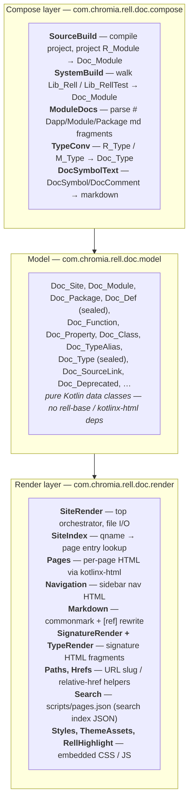
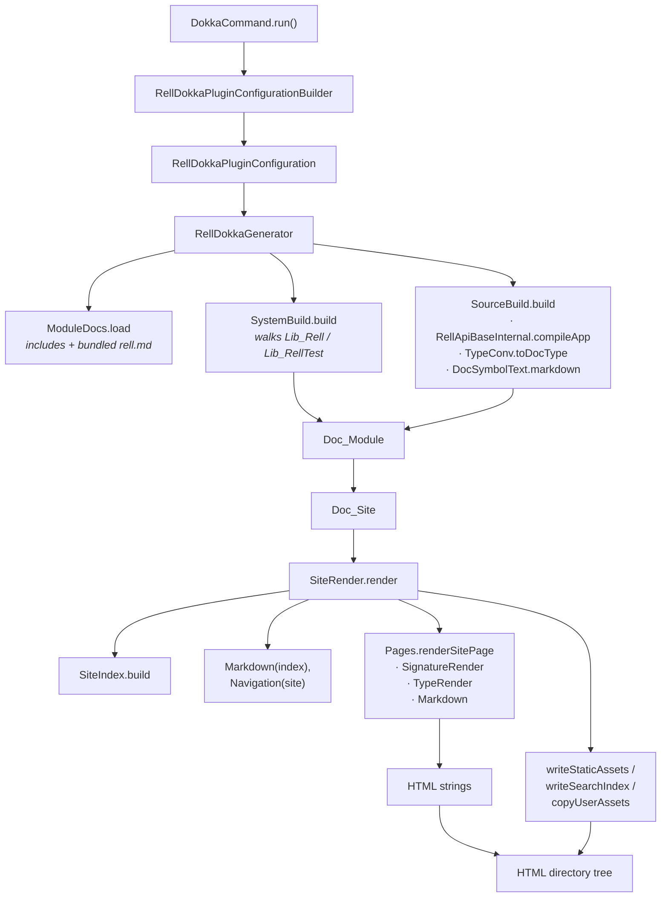

# Technical Architecture & Codebase

## High-Level Architecture

Rell Dokka Plugin is split into two layers connected by an immutable model:



The legacy package `com.chromia.rell.dokka.*` only holds the public CLI / generator / builder shells; everything substantive lives under `com.chromia.rell.doc.*`. The split is intentional &mdash; the public-facing class names (`RellDokkaGenerator`, `RellDokkaPluginConfigurationBuilder`) are pinned by the chromia-cli / gradle-plugin contract and would be expensive to rename.

**Key architectural decisions:**

- **Internal model in the middle.** `Doc_*` data classes are immutable and depend only on the JDK. Compose and render do not share types beyond the model. This keeps the renderer testable without a Rell compiler in the loop (see `SiteRenderTest`).
- **One `Doc_Site` per generator invocation.** The site is a single value computed eagerly; rendering is a pure walk over it.
- **No Dokka.** The previous implementation extended `org.jetbrains.dokka.plugability.DokkaPlugin`; the current one has no Dokka dependency at all. CSS, JS, fonts, and search-index JSON are produced directly.
- **Paths frozen.** `Paths.fileSlug` reproduces Dokka's package-name mangling (`"My Dapp"` → `-my -dapp`) because downstream URL consumers (chromia-cli integration tests, docs.chromia.com) already address those slugs.

## Major Components

### 1. CLI (`com/chromia/rell/dokka/cli/main.kt`)

Clikt command `DokkaCommand` parsing the same flag set the old Dokka-plugin CLI had:

| Flag | Default | Notes |
|---|---|---|
| `--source` | `src` (must exist, dir) | Project root. |
| `--target` | `out` (dir) | Output directory. |
| `--modules` | none | Comma-separated entry-point modules. |
| `--additional-modules` | `[]` | Modules to include and **un-hide** from navigation when also in `--filtered-modules`. |
| `--name` | `My Rell Dapp` | Site title. |
| `--styles` | none | Comma-separated CSS files (copied into `styles/`). |
| `--assets` | none | Comma-separated asset files (copied into `images/`). |
| `--system` | off (hidden flag) | Generate stdlib docs. |
| `--includes` | `[]` | Markdown files containing `# Dapp/Module/Package` fragments. |
| `--source-link` | none | `localDir=remoteUrl[#lineSuffix]`. |
| `--filtered-modules` | `[]` | Modules hidden from navigation (still rendered to disk). |

Footer is hardwired to `"© <year> Chromia"`. The main class is `com.chromia.rell.dokka.cli.MainKt`.

### 2. `RellDokkaGenerator` (`com/chromia/rell/dokka/RellDokkaGenerator.kt`)

Public entry point &mdash; `class RellDokkaGenerator(builder: RellDokkaPluginConfigurationBuilder) { fun generate() }`. Total ~75 lines:

1. `builder.build()` → `RellDokkaPluginConfiguration` (internal POJO).
2. `ModuleDocs.load(includes, additionalTexts)`, including the bundled `rell.md` when `system = true`.
3. Either `SystemBuild.build(...)` or `SourceBuild.build(...)`.
4. Wrap the resulting `Doc_Module` in a `Doc_Site` together with stylesheets / assets / source-links / hidden packages.
5. `SiteRender(targetFolder).render(site)`.

Hidden packages are `config.filteredModules - config.additionalModules` (system-mode forces empty).

### 3. Configuration (`com/chromia/rell/dokka/config/`)

`RellDokkaPluginConfigurationBuilder` &mdash; **the public API**. Two constructors:

- `RellDokkaPluginConfigurationBuilder(title: String, modules: List<String>?, projectRoot: File)` for project docs.
- `RellDokkaPluginConfigurationBuilder.SYSTEM` / `newSystemBuilder()` for stdlib docs (title hard-coded to `"Rell System Library API Reference"`).

Fluent setters: `targetFolder`, `customStyleSheets`, `customAssets`, `footerMessage`, `includes`, `filteredModules`, `additionalModules`, `addSourceLink`, `cliEnv`. The `.build()` method is `internal`; only `RellDokkaGenerator` calls it.

`RellDokkaPluginConfiguration` is the resolved POJO consumed by the generator. There is no `RellDokkaGlobalState` anymore &mdash; the old singleton existed to bypass Dokka's serialization; without Dokka, there is no serialization boundary to cross.

### 4. Compose &mdash; Project Mode (`compose/SourceBuild.kt`)

Drives `RellApiBaseInternal.compileApp` and turns the resulting `R_App` into a single `Doc_Module`. Highlights:

- **Compiler config:** `mountConflictError(false)`, `includeTestSubModules(true)`, `moduleArgsMissingError(false)`, `docSymbolsEnabled(true)` (so every `R_Definition` carries a `DocSymbol`), `appModuleInTestsError(false)`. The optional `cliEnv` is wired into the compiler's IO surface &mdash; chromia-cli passes its `BuildCliEnv` to capture diagnostics.
- **Module fan-out:** each `R_Module` produces one `Doc_Package` for the module root plus one extra `Doc_Package` per nested `namespace { … }` block, keyed under the dotted prefix.
- **Extension functions:** read from `app.functionExtensions.list` (public API, not reflection). Concrete `@extend(target)` implementations are hidden in favor of their `@extendable` target; chained extensions (functions that are both `@extendable` and `@extend(...)`) still surface.
- **Constants & attribute defaults:** rendered using `rrConstantToRtValue` + `rtValueToGtv` so the default text matches what the runtime would emit.
- **Mount names:** included on `Doc_Function` only when the explicit `@mount` differs from the simple name.

The companion `SourceBuild.compile(...)` is the reusable analysis step &mdash; callers can run only the compile portion and get back the `Analysis` record (`modules`, `testModules`, extension tables, app-level-name maps) if they need it without rendering.

### 5. Compose &mdash; System Mode (`compose/SystemBuild.kt`)

Walks the in-process stdlib namespace graph (`Lib_Rell.MODULE` and `Lib_RellTest.MODULE`) with a single recursive `walkLib` that flatens descendents into a `parentQname → defs` map.

- **Members handled:** `L_NamespaceMember_Type`, `_Struct`, `_Function`, `_SpecialFunction`, `_Property`, `_Constant`, `_Alias`, `_Namespace`. Other namespace members (e.g. `_TypeExtension`) are intentionally skipped.
- **Aliases:** type aliases become `Doc_TypeAlias`; function aliases become a copy of the target `Doc_Function` with `aliasOfQname` set, deprecation propagated, and an `"**Alias of** [target]"` suffix attached to the markdown body.
- **Special functions:** only `exists` and `empty` are documented (with a hand-written `(arg: T?) -> boolean` signature). Other special functions cannot be expressed as a `Doc_Function` and are skipped &mdash; matching the previous Dokka-plugin output, which TODO'd them out.
- **Blacklists:** `BLACKLISTED_TYPES = {"guid", "signer"}`, `BLACKLISTED_ALIASES = {"tuid"}`. Aliases are only kept from `Lib_Rell` (the test lib's aliases are skipped).
- **Empty namespaces are dropped** &mdash; they would render an index page with no content.

### 6. Compose &mdash; Module Docs (`compose/ModuleDocs.kt`)

Parses Markdown includes containing fragments of the form:

```markdown
# Dapp My Rell Dapp
… overview …

# Module lib.lib1
… module-level docs …

# Package lib.lib1.nested
… package-level docs …
```

Two maps come out: `moduleDocs` (keyed by site title) and `packageDocs` (keyed by qualified package name, with empty/root keyed as `[root]`). The bundled `src/main/resources/rell.md` is included automatically when `--system` is set.

The old Dokka-plugin rewrote `# Dapp` → `# Module` and `# Module` → `# Package` before handing the file to Dokka's `ModuleAndPackageDocumentation` parser. Without Dokka in the loop, the parser lives here and keeps the user-facing vocabulary directly.

### 7. Compose &mdash; Type Projection (`compose/TypeConv.kt`)

`R_Type.toDocType()` → `M_Type.toDocType()` → `Doc_Type`. Maps `M_Type_Generic` (named, with type args), `M_Type_Tuple`, `M_Type_Function`, `M_Type_Nullable`, `M_Type_Param`, `M_Type_Simple` (Raw fallback). The `qname` field is set whenever the type can be cross-linked &mdash; generic type names with `:` package separators get rewritten to `.` to align with `Doc_Def.qname` and feed `SiteIndex`.

### 8. Compose &mdash; DocSymbol Rendering (`compose/DocSymbolText.kt`)

`DocSymbol.markdown(extraSuffix)` flattens a Rell `DocSymbol` (description + tag map) into a single markdown blob:

- Description goes verbatim.
- `@param name desc` becomes a `**Parameters**` bullet list.
- `@return`, `@throws`, `@see`, `@since`, `@author` each get their own headed bullet section.
- `extraSuffix` (used by aliases for `"**Alias of** [target]"`) is appended at the end.
- `C_Deprecated.toDocDeprecated()` turns a Rell deprecation marker into the renderer's `Doc_Deprecated` (strips the leading two characters Rell prepends to the message and titlecases).

### 9. Model (`com/chromia/rell/doc/model/`)

Three files:

- `DocSite.kt` &mdash; `Doc_Site`, `Doc_Module`, `Doc_Package`, `Doc_SourceLink`.
- `DocDef.kt` &mdash; sealed `Doc_Def` hierarchy (`Doc_Function`, `Doc_Property`, `Doc_Class`, `Doc_TypeAlias`), plus `Doc_Param`, `Doc_TypeParam`, `Doc_Source`, `Doc_Deprecated`, and the `Doc_FunctionKind` / `Doc_ClassKind` enums.
- `DocType.kt` &mdash; sealed `Doc_Type` (`Named`, `Tuple`, `Function`, `Nullable`, `TypeParam`, `Raw`) and `Doc_Type.Arg` (`Invariant`, `SubOf`, `SuperOf`, `Star`).

Everything is `internal` and a plain data class. No mutability, no lazy fields, no dependency on `rell-base` or `kotlinx-html`.

### 10. Render &mdash; Site Orchestration (`render/SiteRender.kt`)

Top-level entry. `render(site)` performs, in order:

1. `outputDir.createDirectories()`.
2. Build `SiteIndex`, `Markdown(index)`, `Navigation(site)`.
3. Emit `index.html` (the site landing page).
4. Emit `navigation.html` (the same sidebar as a standalone file, kept for the iframe pattern the old Dokka nav used).
5. Walk modules → packages → top-level defs → class members, writing each as `<moduleSlug>/<package>/<def>.html` (or `…/<Type>/index.html` for classlike defs, `…/<Type>/<member>.html` for members).
6. Copy user stylesheets into `styles/<sheet>.css` and user assets into `images/<asset>`.
7. Write the static `styles/site.css` (from `Styles.SITE_CSS`) and the bundled fonts (`chromia/fonts/NBInternational/…`, `chromia/fonts/Battlefin-Black.otf`) out of the jar.
8. Write the search index to `scripts/pages.json`.

### 11. Render &mdash; Site Index (`render/SiteIndex.kt`)

A flat `Map<String, Entry>` keyed on qualified name. Entries carry the owning `Doc_Module` / `Doc_Package`, the `Doc_Def` (or null for the package itself), and the owning class for members. `resolve(qname)` is the strict lookup; `resolveAny(name, currentPackage)` first tries `currentPackage.qname + "." + name` for unqualified references inside a package.

Used by `Markdown.kt` for `[ref]` resolution and by `TypeRender.kt` for `<a class="type-link">` href computation.

### 12. Render &mdash; Pages (`render/Pages.kt`)

`Pages.renderSitePage(spec)` builds a single page string. The shell is shared across all pages: `<head>` with embedded `SITE_CSS` + theme-boot + Rell-syntax-highlight JS + optional user stylesheets, then a two-column `<body>` (sidebar + `<main>`). Per-page body is supplied by `PageSpec.body`. There are dedicated renderers for the site index, module index, package index, def page, and class member page.

### 13. Render &mdash; Navigation (`render/Navigation.kt`)

Builds the sidebar `<nav>`. Notable behaviour:

- The root package is rendered inline (`nav-defs-root` list); other packages are rendered as collapsible groups.
- When the site has only one module (the typical case &mdash; system lib, or one dapp), the module heading is suppressed as visual noise; multi-module sites keep the heading.
- The search input carries `data-pages-json` / `data-site-root` attributes so the embedded `SEARCH_JS` can resolve hits regardless of how deep in the tree the current page sits.
- Hidden packages (`Doc_Site.hiddenPackages`) are filtered here. They remain in `SiteIndex` so cross-references still work; only the nav drops them.

### 14. Render &mdash; Markdown (`render/Markdown.kt`)

CommonMark parser + HTML renderer, with two extensions enabled (GFM tables, autolinks). The interesting work is in `ResolveRefsVisitor`: every `Text` node is scanned for `[A.B.C]`-shaped shortcut references (regex `\[([A-Za-z_][A-Za-z_0-9.]*)](?![(\[:])`), and matches that resolve through `SiteIndex.resolveAny` are replaced with `Link` AST nodes pointing at the relative href. Text inside `Code` / `FencedCodeBlock` / `IndentedCodeBlock` is skipped.

`renderSummaryText(markdown)` strips down to a single inline line for navigation summaries.

### 15. Render &mdash; Signature / Type (`render/SignatureRender.kt`, `render/TypeRender.kt`)

`SignatureRender` produces a pre-escaped HTML fragment per `Doc_Def`, mirroring Rell source syntax (`function name(p: T): R`, `@extendable function …`, `@extend(target) function …`, `@mount("…") operation …`, `entity Name`, `type Name<T> : super`, `val NAME: T = 123`, …).

`TypeRender` renders a `Doc_Type` to HTML. Linkable named types become `<a class="type-link" href="…">`; non-linkable bits land inside `<span class="type-name">`. Output is injected via `unsafe { +html }`, which is why the renderer escapes every value it doesn't emit as a tag.

### 16. Render &mdash; Path / Href Helpers (`render/Paths.kt`, `render/Hrefs.kt`)

`Paths.fileSlug` is the Dokka-compatible slug mangler &mdash; lowercase letters and digits stay, uppercase ASCII becomes `-` + lowercase, everything else passes through. `urlEncodeName` turns `function#N` into `function%23N`. The full path layout is documented in `SiteRender`'s KDoc.

`Hrefs.relativeFrom(from, to)` does the `../`-prefixed relative-path computation given two forward-slash paths.

### 17. Render &mdash; Search (`render/Search.kt`)

Writes `scripts/pages.json`. Schema is `[{name, description, location, searchKeys[]}, …]` &mdash; identical to what the old Dokka plugin emitted, so any downstream search bar keeps working. JSON is rendered without `kotlinx.serialization` (`appendStringField` / `appendJsonString` are small enough that the dependency wasn't worth it).

### 18. Render &mdash; Assets (`render/Styles.kt`, `render/ThemeAssets.kt`, `render/RellHighlight.kt`)

- `Styles.SITE_CSS` &mdash; the entire site stylesheet as a Kotlin string constant.
- `ThemeAssets` &mdash; `THEME_BOOT_JS` (sets up `prefers-color-scheme` + localStorage at first paint), `THEME_TOGGLE_SVG`, `SEARCH_JS`.
- `RellHighlight.RELL_HIGHLIGHT_JS` &mdash; small client-side highlighter for `<code class="lang-rell">` blocks in doc comments.

Bundled fonts live under `src/main/resources/chromia/fonts/` and are copied out at render time so the `@font-face` URLs in `SITE_CSS` resolve. Missing font resources are silently skipped &mdash; the CSS has a system-font fallback chain.

## Component Communication



State management is trivial: every long-lived helper (`SiteIndex`, `Markdown`, `Navigation`, `SignatureRender`, `TypeRender`) is constructed once per `render()` call and discarded when the call returns.

## Key Frameworks, Libraries, and Versions

### Production Dependencies

- `:rell-api-base`, `:rell-base` &mdash; Rell compiler frontend, runtime model, and in-process standard library. Same module versions as the rest of the repository.
- `libs.kotlinx.html` &mdash; HTML DSL.
- `libs.commonmark`, `libs.commonmark.ext.gfm.tables`, `libs.commonmark.ext.autolink` &mdash; Markdown.
- `libs.clikt` &mdash; CLI parsing.

### Test Dependencies

- `kotlin("test-junit5")`
- `libs.assertk` &mdash; fluent assertions
- `libs.log4j.slf4j2.impl` &mdash; SLF4J implementation

### Gradle Plugin

The module applies `kotlin.jvm` + `application`. `application.mainClass = "com.chromia.rell.dokka.cli.MainKt"`.
JaCoCo's class-directories list excludes `**/cli/*` from coverage. Tests run on JUnit Platform, single-threaded.
