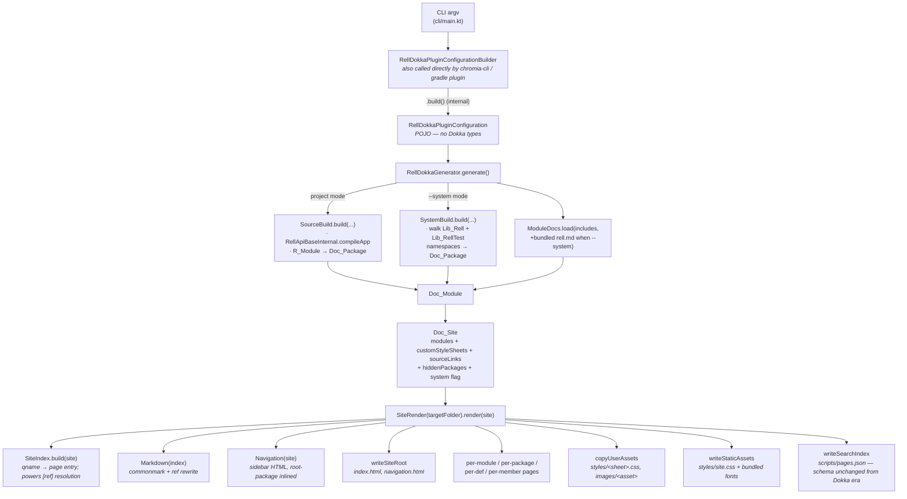

# Introduction

**Project Name:** Rell Dokka Plugin

## Project Summary

Rell Dokka Plugin is a **self-contained HTML documentation generator** for the Rell programming language. The "dokka"
in the name and in the package layout is historical &mdash; earlier versions were implemented as a JetBrains Dokka plugin.
The current implementation no longer depends on it: it walks the Rell compiler model directly, builds an internal
site model (`Doc_Site`), and renders the whole site with kotlinx.html + a CSS/JS bundle shipped inside the jar.

The plugin works by:

1. **Loading a Rell program model** &mdash; either by compiling a user project through `RellApiBaseInternal.compileApp`(`SourceBuild`), or by walking the in-process standard library (`Lib_Rell.MODULE` + `Lib_RellTest.MODULE`) via the `L_Namespace` graph (`SystemBuild`).
2. **Projecting it to a renderer-only model** &mdash; `R_Module` / `L_Namespace` definitions are converted to the immutable `Doc_*` data classes in `com.chromia.rell.doc.model`. The renderer never sees a compiler type.
3. **Writing an HTML directory tree** &mdash; `SiteRender` walks the `Doc_Site` and emits `index.html`, `navigation.html`, `scripts/pages.json`, `styles/site.css`, per-module / per-package / per-def pages, and copies user-supplied stylesheets/assets plus bundled fonts.

The plugin ships as a CLI (`com.chromia.rell.dokka.cli.MainKt`) and as a library: `RellDokkaGenerator(builder).generate()` is the entry point called from both chromia-cli and `rell-gradle-plugin`.

## Value Creation

Rell Dokka Plugin enables developers to:

- **Generate API documentation automatically** from compiled Rell source and doc comments, with no manual maintenance.
- **Publish a reference for the Rell standard library** directly from the in-process `L_NamespaceMember` graph &mdash; no source files needed, so the output always reflects the version of `rell-base` linked into the jar.
- **Keep cross-references working** &mdash; `[rell.qualified.name]` inside doc comments resolves through `SiteIndex` (a flat `qname → page` map) and gets rewritten to relative HTML links at render time.
- **Ship a single binary** &mdash; no Dokka, no Kotlin compiler, no Gradle plugin runtime required on the consumer side. The CLI bundles everything.
- **Match the historical Dokka-plugin URL layout** so downstream tooling (chromia-cli integration tests, docs.chromia.com) keeps working without URL rewrites. The `Paths.fileSlug` rule is intentionally preserved verbatim (`"My Dapp"` → `-my -dapp`, `function#0` → `function%230`).

## Upstream and Downstream Projects

### Upstream Dependencies (What Rell Dokka Plugin Consumes)

**1. `rell-base` and `rell-api-base`**
- **Role:** Provide the Rell compiler frontend, the runtime model (`R_Module`, `R_Function`, `R_Type`, …), the in-process standard library (`Lib_Rell`, `Lib_RellTest`), and `RellApiBaseInternal.compileApp` / `RellApiCompile`.
- **Source:** Sibling modules &mdash; `:rell-api-base` and `:rell-base`.
- **Critical dependency:** All `Doc_*` content is derived from these. The plugin runs in-process and links against the same `rell-base` classes that are linked into the consumer (chromia-cli, gradle plugin) &mdash; there is no version negotiation: whatever stdlib symbols `Lib_Rell.MODULE` exposes is what gets documented.
- **Internal-API opt-in:** `SourceBuild` is `@OptIn(InternalRellApi::class)` because it uses `RellApiBaseInternal.compileApp` / `RellApiBaseInternal.makeCompilerOptions`.

**2. `kotlinx-html-jvm`**
- **Role:** Type-safe HTML DSL for `Pages.kt`, `Navigation.kt`, and the signature/type renderers.
- **Source:** Maven Central, version pinned via `libs.kotlinx.html` in the version catalog.

**3. `commonmark` (+ `commonmark-ext-gfm-tables`, `commonmark-ext-autolink`)**
- **Role:** Markdown parsing and HTML rendering for doc comments. `Markdown.kt` post-processes the AST to rewrite `[qname]` shortcut-style references into `<a href>` links via `SiteIndex`.

**4. `clikt`**
- **Role:** Command-line option parsing in `cli/main.kt`.

### Downstream Projects (What Consumes Rell Dokka Plugin)

**1. Chromia CLI**
- Calls `RellDokkaGenerator(builder).generate()` from `GenerateDocsSiteCommand`. The constructor + `generate()` shape is part of the public contract and cannot change without coordinating a chromia-cli release. Chromia CLI passes its own `BuildCliEnv` (a `RellCliEnv` subtype) via `builder.cliEnv(...)`.

**2. Rell Gradle Plugin**
- Uses the same builder + generator from `RellDocsTask`.

**3. Rell System Library Documentation (docs.chromia.com)**
- Generated by running the CLI with `--system`. `work/build-local-docs.sh` is the local-preview script for this mode.

## Data and Control Flow

### Control Flow Details

**Configuration:**
- `RellDokkaPluginConfigurationBuilder` is the public surface. Two constructor paths: app docs (`RellDokkaPluginConfigurationBuilder(title, modules, projectRoot)`) and system docs (`RellDokkaPluginConfigurationBuilder.SYSTEM` / `newSystemBuilder()`).
- `.build()` is `internal` &mdash; the generator is the only consumer. The output is a plain `RellDokkaPluginConfiguration` data class; there is no Dokka `DokkaConfiguration` anywhere.
- Filesystem inputs are accepted as `java.io.File` on the builder and stored as `java.nio.file.Path` internally.

**Source analysis (`SourceBuild`):**
- Builds a `RellApiCompile.Config` with `docSymbolsEnabled(true)`, `includeTestSubModules(true)`, `mountConflictError(false)`, `moduleArgsMissingError(false)`, `appModuleInTestsError(false)`, and the optional `cliEnv` from the builder.
- Calls `RellApiBaseInternal.compileApp(...)` to get the full `R_App`, then projects each non-test `R_Module` and each test `R_Module` into `Doc_Package`s.
- Extension functions: `app.functionExtensions.list` provides the public mapping from extendable target → extension implementations. No reflection is involved (the previous Dokka-plugin had to reflect into private fields; the current `rell-base` exposes the table through a public API).
- A Rell module's nested `namespace { … }` blocks turn into sibling `Doc_Package`s keyed under the dotted prefix (e.g. `lib.lib1` + `lib.lib1.nested`).

**System library (`SystemBuild`):**
- Walks `Lib_Rell.MODULE.lModule.namespace` and `Lib_RellTest.MODULE.lModule.namespace` recursively.
- Each `L_NamespaceMember_*` becomes the corresponding `Doc_Def`. Empty namespaces are filtered. Blacklists (`guid`, `signer`, `tuid`) match the historical Dokka-plugin output.
- A bundled `rell.md` resource (under `src/main/resources/`) is folded into the documentation automatically when `--system` is set, so the package summaries appear without `--includes`.

**Rendering:**
- `SiteRender` first builds the `SiteIndex`, then the `Markdown` / `Navigation` helpers, then walks the site emitting one HTML file per definition.
- The renderer is **purely a string→file emitter**: every `Pages.kt` method returns a `String` and `SiteRender` is responsible for the I/O. This makes the renderer easy to test in isolation (see `SiteRenderTest`).

### Data Persistence

- In-memory only during a single `generate()` call.
- The only output is the HTML directory tree under `targetFolder`. There is no database, no cache, no temp files.
- The bundled CSS / JS / font assets are read from the jar's `src/main/resources/` (notably `chromia/fonts/...` and `rell.md`).

## External References and Resources

### Rell Language Documentation
- **Rell Documentation:** https://docs.chromia.com/rell/

### Library References
- **kotlinx.html:** https://github.com/Kotlin/kotlinx.html
- **commonmark-java:** https://github.com/commonmark/commonmark-java
- **clikt:** https://ajalt.github.io/clikt/
