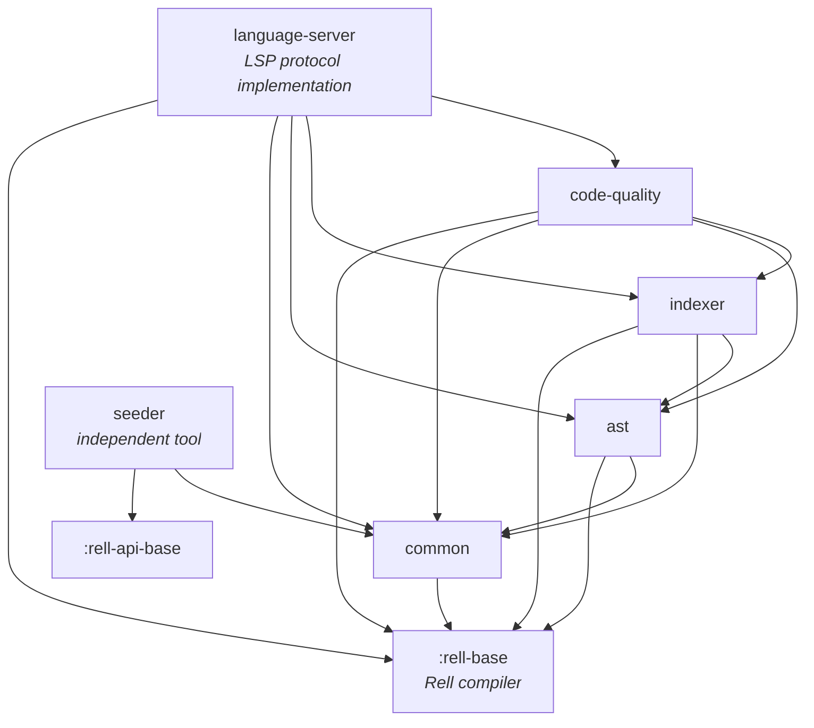
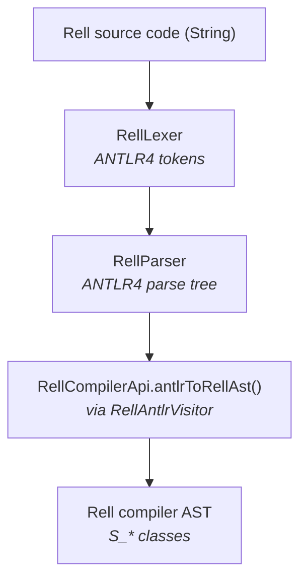
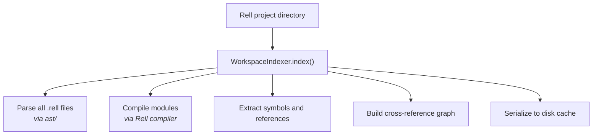
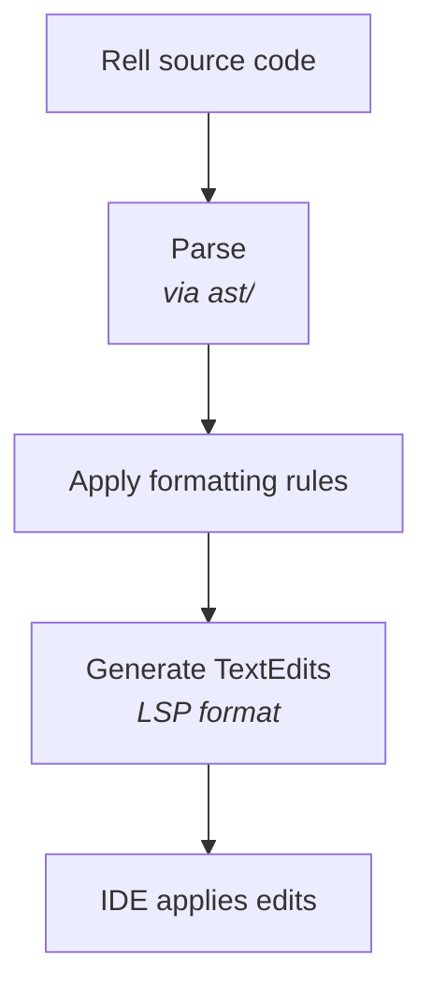
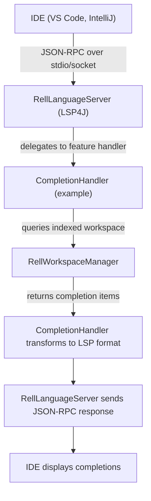
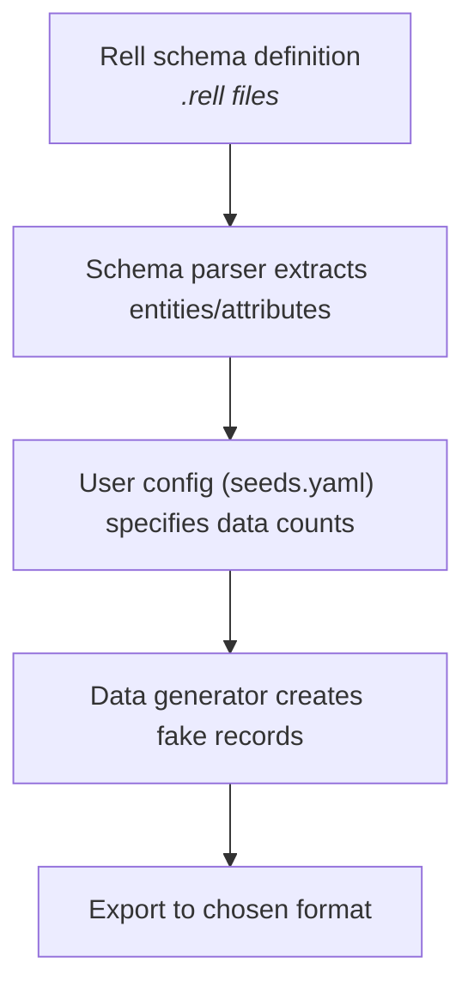

# System Architecture

## Document Purpose

This document explains the **system architecture** of Rell Toolbox: how modules relate to each other, the data flow through the system, and key architectural decisions.

Assumes you've read **01-project-overview.md**.

---

## Architectural Overview

Rell Toolbox follows a **modular layered architecture** where:
- Lower layers provide foundational services (parsing, utilities)
- Middle layers build analysis capabilities (indexing, quality checks)
- Top layer exposes capabilities via standard protocols (LSP)

### Design Philosophy

1. **Separation of Concerns**: Each module has a single, well-defined responsibility
2. **Dependency Inversion**: Higher-level modules depend on abstractions, not concrete implementations
3. **IDE-Friendly**: Designed for incremental, real-time analysis (not batch processing)
4. **Compiler Integration**: Reuses Rell compiler's type system and semantics where possible
5. **Cacheable**: Heavy operations (workspace indexing) are serialized to disk for fast restarts

---

## Module Dependency Graph

`language-server` is the top layer; `seeder` is standalone, depending only on `common` and the
public tooling API.

### Dependency Rules

- **Acyclic Dependencies**: No circular dependencies between modules
- **Common Is Universal**: `common/` is a shared dependency for all modules
- **Language Server Is Top**: Only `language-server/` talks to IDEs; other modules are internal
- **Seeder Is Isolated**: `seeder/` does not depend on AST or indexer (simpler, standalone tool)

---

## Module Responsibilities

### 1. `ast/` - Parsing and Syntax Trees

**Responsibility**: Convert Rell source text into Abstract Syntax Trees (AST).

**Why It Exists**: The Rell compiler's native parser fails completely on syntax errors. IDEs need **error-tolerant parsing** to handle incomplete code as users type.

**Key Components**:
- `RellLexer`, `RellParser` - ANTLR4-generated lexer and parser, produced from the compiler's `Rell.g4` in `:rell-base:frontend`
- `AntlrRellParser` - High-level API for parsing Rell code
- `RellCompilerApi.antlrToRellAst()` - Turns an ANTLR parse tree into the compiler's internal AST, via the compiler's `RellAntlrVisitor`

**Data Flow**:

**Why Two AST Formats?**
- **ANTLR AST**: Error-tolerant, IDE-friendly
- **Rell Compiler AST**: Semantic analysis-friendly, type checking

The `RellCompilerApi.antlrToRellAst()` bridge allows IDE tools to benefit from both.

---

### 2. `common/` - Shared Utilities

**Responsibility**: Provide reusable utilities for all modules.

**Key Components**:
- **EditorConfig Support**: `EditorConfigParser` reads `.editorconfig` files; `FormatterOptions` and `LinterOptions` interpret the properties
- **Resource Abstraction**: `Resource` represents compiled Rell files
- **Shared Utilities**: URI handling, offset/position conversion, text replacement

**Why It Exists**: Prevents code duplication across modules.

---

### 3. `indexer/` - Workspace Indexing

**Responsibility**: Analyze entire Rell projects and build symbol indexes for IDE features (go-to-definition, find-references).

**Key Components**:
- `WorkspaceIndexer` - Main orchestrator
- Symbol tables (global, module, local scopes)
- Cross-reference tracker (calls, usages, declarations)
- Error collector (diagnostics from compilation)

**Data Flow**:

**Cache Strategy**:
- Serialized using **Fory** (high-performance binary format)
- Stored in OS temp directory (`/tmp` or equivalent)
- Keyed by workspace path

**Why Caching Matters**: Indexing a large Rell project can take seconds. Caching reduces IDE startup time from seconds to milliseconds.

---

### 4. `code-quality/` - Formatting and Linting

**Responsibility**: Apply consistent formatting rules to Rell code.

**Key Components**:
- `FormattableDocument` - Tracks formatting violations and fixes
- Text replacement utilities (diff-based)
- Formatting rule engine

**Configuration**:
- `.rellformat` files (Rell-specific)
- `.editorconfig` files (cross-language standard)

**Data Flow**:

**Integration**:
- Used by `language-server/` for document formatting requests
- Can be run standalone (CLI tool - not documented if this exists)

---

### 5. `language-server/` - LSP Implementation

**Responsibility**: Expose all tooling capabilities via **Language Server Protocol** (LSP).

**Key Components**:
- `RellLanguageServer` - Implements LSP4J interfaces
- `RellWorkspaceManager` - Manages indexed workspace
- Feature-specific packages:
  - `completion/` - Code completion
  - `diagnostics/` - Error/warning conversion
  - `hover/` - Hover information
  - `symbols/` - Go-to-definition, find-references
  - `tokens/` - Semantic syntax highlighting
  - `inlayhints/` - Inline type hints
  - `editing/` - Document lifecycle management

**Architecture Pattern**: Dependency Injection with **Koin**
- Modules define dependencies (`KoinModule`)
- `RellLanguageServerModule` wires everything together
- Allows swapping implementations for testing

**Launch Modes**:
1. **Stdio** (production):
   - Communicates over stdin/stdout
   - Used by IDE extensions
   - Entry: `com.chromaway.rell.tools.lsp.StdioMain`

2. **Socket** (development):
   - Communicates over TCP socket (default port: 5007)
   - Allows attaching debugger to LSP server process
   - Entry: `com.chromaway.rell.tools.lsp.SocketMain`

**Data Flow** (typical LSP request):

---

### 6. `seeder/` - Test Data Generation

**Responsibility**: Generate realistic test data for Rell applications.

**Key Components**:
- Schema parser (extracts entity definitions from Rell code)
- Data generator (uses Kotlin Faker for realistic fake data)
- Configuration parser (YAML/JSON)
- Export serializers (JSON, YAML, SQL, CSV, Rell)

**Data Flow**:

**Status**: Partially complete
- ✅ Schema parsing
- ✅ Fake data generation
- ✅ File export (JSON, YAML, etc.)
- ❌ Direct database insertion (marked TODO)

---

## Cross-Cutting Concerns

### Error Handling

**Philosophy**: Fail gracefully; never crash the LSP server.

**Strategies**:
1. **Parser Errors**: ANTLR4 error recovery continues parsing after syntax errors
2. **Compilation Errors**: Collected and converted to LSP diagnostics
3. **Runtime Errors**: Caught at LSP request boundaries; written to the local log
4. **Cache Corruption**: Falls back to full re-indexing

**Logging**:
- **Production**: Log4J2 to a local rolling file and the console
- **Development**: Verbose logging to console

### Performance Considerations

**Challenge**: IDEs expect instant responses (< 100ms for most operations).

**Optimizations**:
1. **Incremental Parsing**: Only re-parse changed files
2. **Workspace Caching**: Serialize entire index to disk
3. **Lazy Loading**: Don't index until first request
4. **Background Processing**: Indexing happens off the critical path

**Known Bottleneck**: Initial workspace indexing on large projects (no documented benchmarks).

### Testing Strategy

**Unit Tests**: Each module has comprehensive JUnit5 tests
**Integration Tests**: `indexer/` includes real-world Rell projects in test resources
**Coverage**: JaCoCo reporting enabled (exact coverage % not documented)

### Security

**Threat Model**: LSP server runs locally, trusted input from IDE.

**Mitigations**:
- No network access, and no error or usage reporting: the language server never
  transmits anything. Reporting a problem is the host IDE plugin's job, since only it
  can ask the user for consent
- No code execution (Rell code is analyzed, not executed)
- File system access limited to workspace directory

**Known Risks**: None documented.

---

## Architectural Decisions (Rationale)

### Why ANTLR4 Instead of Native Rell Parser?

**Decision**: Use ANTLR4 with custom grammar instead of Rell compiler's parser.

**Rationale**:
- Rell compiler parser is **non-recoverable** (fails on first syntax error)
- IDEs need parsers that handle incomplete/broken code
- ANTLR4 provides error recovery out-of-the-box

**Trade-off**:
- ❌ Must manually sync grammar with upstream Rell compiler
- ✅ IDE features work even with syntax errors

### Why Fory for Serialization?

**Decision**: Use Fory (formerly Fury) instead of Java serialization or Protocol Buffers.

**Rationale**:
- **Performance**: Fory is 5-10x faster than Java serialization

### Why Koin for Dependency Injection?

**Decision**: Use Koin instead of Dagger, Guice, or Spring.

**Rationale**:
- **Lightweight**: No annotation processing, no reflection (Kotlin DSL)
- **Simplicity**: Easy to understand for maintainers

**Trade-off**:
- ❌ No compile-time validation (errors at runtime)
- ✅ Faster build times, simpler setup

### Why Multi-Module Gradle Project?

**Decision**: Split into 6 modules instead of a monolith.

**Rationale**:
- **Separation of Concerns**: Clear boundaries between components
- **Testability**: Easier to test modules in isolation
- **Reusability**: `seeder/` can be used independently of `language-server/`

**Trade-off**:
- ❌ More complex build configuration
- ✅ Better maintainability long-term

---